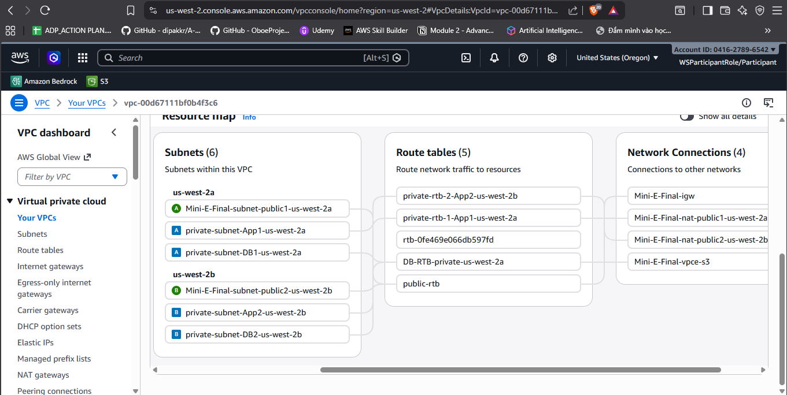
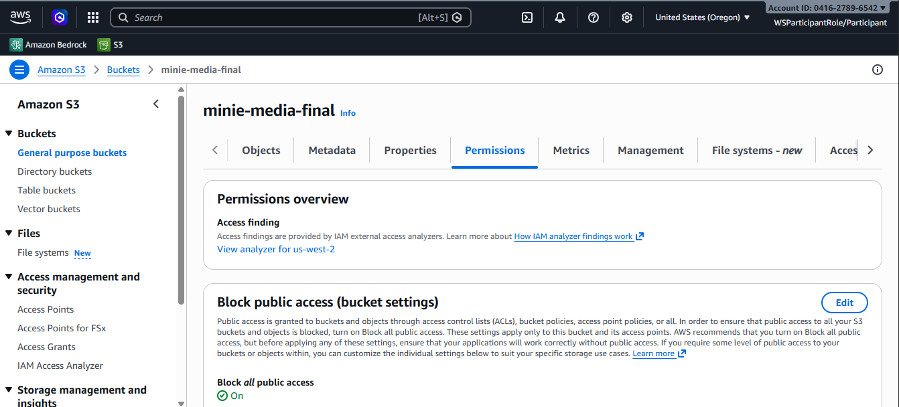

# Week 2 Final Evidence

## 1. Kiến trúc Tổng quan (Architecture & VPC)
Kiến trúc được nâng cấp từ W1, triển khai mô hình mạng VPC với các tier rõ ràng và phân tách lớp mạng bằng Security Groups:
- **ALB-SG**: Chỉ mở Inbound port 80/443 từ Internet.
- **App-SG (ECS Fargate)**: Chỉ nhận luồng traffic hướng từ ALB-SG vào cổng của App.
- **DB-SG (RDS)**: Nằm ở Private Database Tier, chỉ nhận traffic (port 3306) nội bộ từ App-SG.
- Sơ đồ VPC đã được mở rộng và label rõ các Tier hiện có, đồng thời bổ sung **Private Database Tier** ở dưới cùng.

## 2. Lưu trữ Dữ liệu (Storage & Data Layer)
### Amazon S3
Nhóm đã phân tách Data Layer thành các bucket chuyên biệt để giảm Blast Radius và tối ưu chi phí:
1. `user-media`: Lưu trữ ảnh sản phẩm, avatar.
2. `logs-audit`: Lưu log an ninh tập trung từ CloudTrail.
3. `backup-archive`: Lưu trữ backup và DB snapshot.

**Cấu hình bảo mật bắt buộc trên toàn bộ S3 Buckets:**
- **Block Public Access**: Đã bật (ON) ở cấp độ Bucket/Account để ngăn chặn rò rỉ dữ liệu ngoài ý muốn.
- **Default Encryption**: Đã kích hoạt tính năng mã hóa mặc định trên tất cả các bucket.
- **Versioning**: Đã BẬT để lưu lại các phiên bản file, phòng chống ransomware hoặc xóa nhầm.

### Amazon EBS (Database Storage)
- Ổ cứng lưu trữ cho cụm cơ sở dữ liệu RDS sử dụng loại block storage **EBS gp3**, mang lại hiệu suất cố định 3000 IOPS, cân bằng tốt nhất giữa Performance và Cost.

## 3. Quản lý Danh tính và Phân quyền (IAM Baseline)
Nền tảng IAM được thiết lập chặt chẽ theo nguyên tắc Quyền tối thiểu (Least Privilege):
- **Tài khoản Root**: Đã thiết lập MFA (Multi-Factor Authentication). Không sử dụng tài khoản Root cho các thao tác hàng ngày qua Console.
- **IAM Users & Groups**: Tạo một Admin group và cấp phát các **Named IAM Users** riêng biệt cho từng thành viên trong nhóm.

- **Xử lý Feedback IAM**: Toàn bộ các IAM policy được rà soát. Đã loại bỏ/khắc phục các cảnh báo liên quan đến **wildcard policies (`*`)** bị flag từ đầu W2.
- **Không dùng Access Key**: Ứng dụng ECS không hard-code Access Key. Thay vào đó, nhóm sử dụng **ECS Task Role** có định danh cụ thể để container nhận thông tin xác thực an toàn qua AWS STS.

## 4. Bảo mật Dữ liệu (KMS Encryption)
Thiết lập mã hóa (Data at rest) làm cốt lõi cho mọi tài nguyên bằng các bộ khóa tự quản lý Customer Managed Key (CMK):
- Sử dụng `key-media` bọc bucket `user-media`.
- Sử dụng `key-logs` bọc bucket `logs-audit`.
- Sử dụng `key-backup` bọc bucket `backup-archive` và luồng RDS Snapshot.
*(Chỉ Admin/DBA được cấp quyền decrypt khóa backup để thực thi restore).*

## 5. Giám sát hệ thống và Kiểm toán (Observability)
- **AWS CloudTrail**: Bao quát toàn bộ AWS Account, kéo log tập trung về bucket `logs-audit` để truy vết hành động thay đổi hạ tầng.
- **Amazon CloudWatch**: Kết nối thu thập log ứng dụng thời gian thực từ cấu hình của ALB, ECS và RDS.

---

## 6. W2 Trainer Feedback (Kế thừa và xử lý trong W3)
Vào cuối tuần 2, nhóm đã nhận được các feedback sau từ Trainer. **Toàn bộ các mục này sẽ được đưa vào "W2 Recap" của báo cáo W3 và sẽ được giải quyết triệt để trong W3:**

1. **ECS task placement**: ECS task hiện đang ở public subnet — **hành động W3:** Chuyển sang private subnet.
2. **ALB HTTPS**: Load Balancer chưa bảo mật luồng truyền — **hành động W3:** Bật HTTPS (port 443) và gắn ACM cert.
3. **VPC Endpoints cho ECR**: ECR đang pull image từ bên ngoài internet — **hành động W3:** Dùng VPC Interface Endpoint (không dùng public docker.asia).
4. **Secrets Manager Injection**: Cách nạp biến nhạy cảm chưa an toàn — **hành động W3:** Sửa cách inject env var vào container (sử dụng `secrets` config của Task Definition).
5. **Tồn đọng W1**: Giải quyết nốt feedback W1 về Caching và mã hóa ECS-DB encryption.
