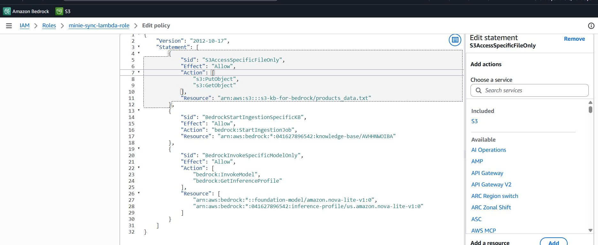
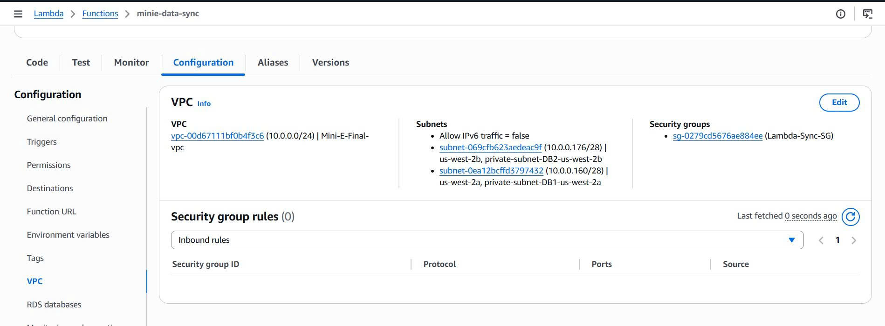
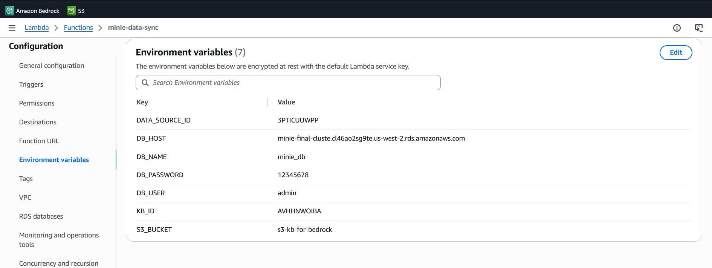

# 🤖 AI Bedrock Layer - Knowledge Base + Retrieval

Tài liệu này minh chứng việc triển khai Knowledge Base sử dụng Amazon Bedrock để trả lời các câu hỏi dựa trên dữ liệu sản phẩm.

---

## Bước 1: Khởi tạo S3 Bucket và Amazon Bedrock Knowledge Base

* **1.1. Chuẩn bị S3 Bucket:** Đây là nơi chứa các file text về sản phẩm của Database.
* **1.2. Tạo dữ liệu mẫu:** Tạo sẵn 3 file text (`.txt` hoặc `.json`) để test ghi thông tin 3 sản phẩm của bạn (ví dụ: `sp1.txt`, `sp2.txt`, `sp3.txt`) và nhấn Upload vào bucket S3 này.
  
  

* **1.3. Truy cập giao diện:** Truy cập vào giao diện quản lý **Amazon Bedrock** trên AWS Console.
* **1.4. Tạo Knowledge Base:** Chọn **Knowledge Base** > **Create Knowledge Base**, và chọn tùy chọn **Knowledge Base With Vector Store**.
* **1.5. Cấu hình Data Source:** Chọn Data source type là **S3**.
* **1.6. S3 URI:** Nhấn nút **Browse S3**, trỏ vào bucket đã tạo ở bước 1.1.
* **1.7. Embeddings Model:** Chọn mô hình **Titan Embeddings V2** hoặc **Titan Embeddings G1**.

  

* **1.8. Vector Store:** Chọn mục đầu tiên **Quick create a new vector store** (hoặc tạo sẵn trực tiếp từ S3).
* **1.9. Hoàn tất tạo:** Nhấn **Create**. Sau khi tạo xong, tiến hành **Sync** dữ liệu.
* **1.10. Test Knowledge Base:** Chọn model **Nova 2 Lite** để test. Kết quả cho thấy AI trả lời chính xác và có dẫn nguồn rõ ràng:

  

---

## Bước 2: Chuẩn bị Layer (Thư viện MySQL)

Lambda mặc định không có thư viện để kết nối MySQL. Bạn phải tự tạo một "Layer" và upload lên.

**Các bước thực hiện trên máy tính cá nhân:**
1. Tạo một thư mục tên là `nodejs`. *(Bắt buộc phải tên là `nodejs`)*.
2. Mở Terminal/CMD tại thư mục đó và chạy lệnh:
   ```bash
   npm install mysql2
   ```
3. Nén thư mục `nodejs` này lại thành file `mysql-layer.zip`.
4. Lên **AWS Console** -> **Lambda** -> **Layers** -> **Create layer**.
5. Đặt tên là `mysql2-library`, upload file `.zip` lên và chọn Runtime là **Node.js 20.x**.

---

## Bước 3: Cấu hình IAM Role

Lambda cần "thẻ quyền lực" để nói chuyện với các dịch vụ khác. Tạo 1 Role mới cho Lambda với Policy JSON như sau:



---

## Bước 4: Cấu hình Mạng (VPC & Security Group)

Đây là phần khó nhất, nếu cấu hình sai Lambda sẽ bị Timeout.

### A. Security Group (SG)
* **Lambda-SG:** Không cần cấu hình Inbound Rule, Outbound cho phép tất cả (All traffic).
* **RDS-SG:** Thêm Inbound Rule cho cổng `3306`, Source là ID của `Lambda-SG`.

### B. VPC Endpoint
Vì Lambda nằm trong Private Subnet, nó cần "cổng đi tắt" để gọi Bedrock:
1. Vào **VPC** -> **Endpoints** -> **Create**.
2. Tìm Service: `com.amazonaws.us-west-2.bedrock-agent` *(Lưu ý: bắt buộc phải có chữ agent)*.
3. Chọn đúng VPC và Subnets mà Lambda đang dùng.
4. Gán Security Group cho phép cổng `443` (HTTPS) từ Lambda.



---

## Bước 5: Tạo Lambda & Cấu hình

1. **Tạo Lambda Function:** Chọn Runtime là **Node.js 20.x**.
2. **Gán Layer:** Kéo xuống dưới cùng trang Lambda -> **Add a layer** -> **Custom layers** -> Chọn `mysql2-library` đã tạo ở Bước 2.
3. **Cấu hình VPC:** Chọn đúng VPC, Subnets và `Lambda-SG`.
   > **Quan trọng:** Chọn **IPv4 only** ở phần IP address type.
4. **Biến môi trường (Environment Variables):**
   * `DATA_SOURCE_ID`: ID của Data Source (Lấy trong phần cấu hình Data source của Bedrock Console).
   * Khai báo thêm các biến môi trường cho Database (như DB_HOST, DB_USER, DB_PASSWORD, DB_NAME, KB_ID, S3_BUCKET).



---

## Bước 6: Code logic xử lý (index.mjs)

Đoạn mã sau sẽ thực hiện chuỗi hành động: kết nối RDS -> lấy dữ liệu -> đẩy file lên S3 -> kích hoạt Bedrock Sync.

```javascript
import mysql from 'mysql2/promise';
import { S3Client, PutObjectCommand } from "@aws-sdk/client-s3";
import { BedrockAgentClient, StartIngestionJobCommand } from "@aws-sdk/client-bedrock-agent";

// Khởi tạo các Client bên ngoài handler để tái sử dụng (tăng hiệu năng)
const s3Client = new S3Client({});
const bedrockClient = new BedrockAgentClient({ region: "us-west-2" });

export const handler = async (event) => {
    let connection;
    try {
        console.log("Đang kết nối tới RDS...");
        connection = await mysql.createConnection({
            host: process.env.DB_HOST,
            user: process.env.DB_USER,
            password: process.env.DB_PASSWORD,
            database: process.env.DB_NAME
        });

        // 1. Lấy dữ liệu sản phẩm từ bảng của dự án
        const [rows] = await connection.execute('SELECT * FROM products');
        
        // 2. Chuyển dữ liệu thành dạng văn bản để AI dễ đọc
        const dataContent = rows.map(item => 
            `Sản phẩm: ${item.title} | Giá: ${item.price} | Mô tả: ${item.description}`
        ).join('\n');

        console.log("Đang upload dữ liệu lên S3...");
        // 3. Đẩy file lên S3 (tên key phải khớp với policy/dataSource)
        await s3Client.send(new PutObjectCommand({
            Bucket: process.env.S3_BUCKET,
            Key: 'products_data.txt',
            Body: dataContent,
            ContentType: 'text/plain'
        }));

        console.log("Đang kích hoạt Bedrock Sync...");
        // 4. Ra lệnh cho Bedrock cập nhật kiến thức mới
        await bedrockClient.send(new StartIngestionJobCommand({
            knowledgeBaseId: process.env.KB_ID,
            dataSourceId: process.env.DATA_SOURCE_ID
        }));

        return {
            statusCode: 200,
            body: JSON.stringify({ message: "Đồng bộ dữ liệu dự án mini_e thành công!" })
        };

    } catch (error) {
        console.error("Lỗi chi tiết từ AWS:", error);
        return {
            statusCode: 500,
            body: JSON.stringify({ 
                msg: error.message || "Không có message",
                code: error.code || error.name || "Không có code",
                requestId: error.$metadata?.requestId || "N/A",
                stack: error.stack // In stack trace để xác định chính xác dòng bị lỗi
            })
        };
    } finally {
        if (connection) await connection.end();
    }
};
```

---

## Bước 7: Tự động hóa (Trigger)

Để hệ thống tự động cập nhật dữ liệu hàng ngày mà không cần ấn thủ công:

1. Tại giao diện hàm Lambda, nhấn **Add trigger**.
2. Chọn nguồn là **EventBridge (CloudWatch Events)**.
3. Tạo Rule mới, chọn **Schedule expression**.
4. Nhập biểu thức: `rate(1 day)` *(Cứ 24h tự động chạy hàm 1 lần)*.