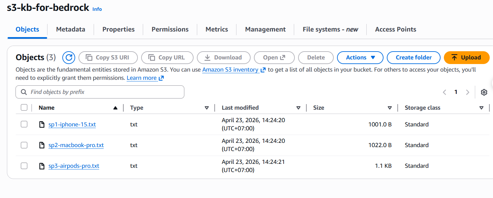
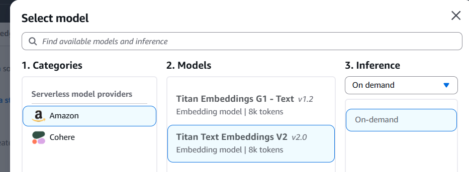
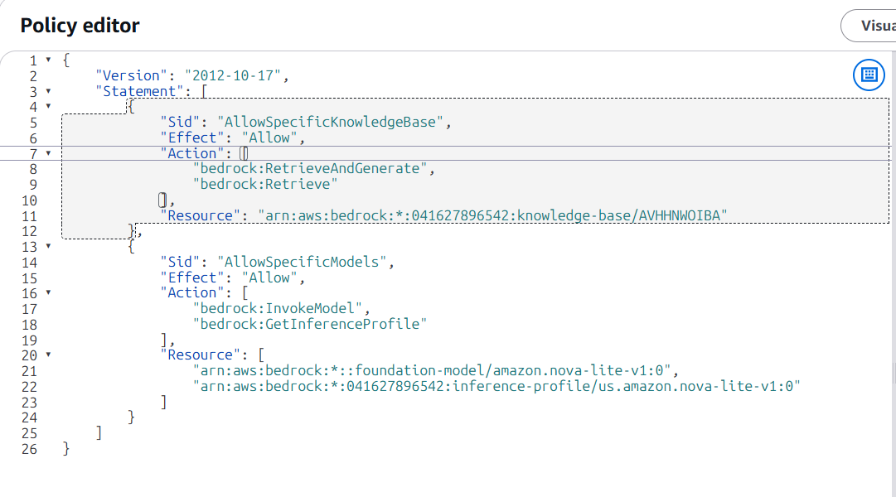
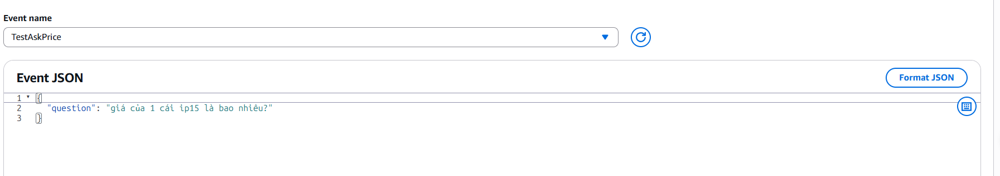
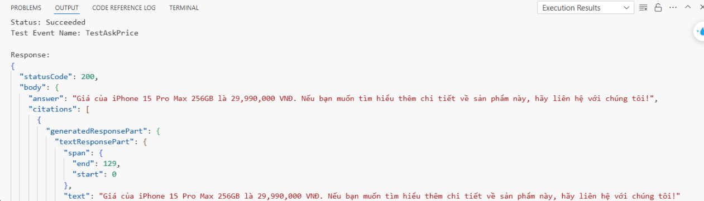

#  AI Bedrock Layer - Knowledge Base + Retrieval

Tài liệu này minh chứng việc triển khai Knowledge Base sử dụng Amazon Bedrock để trả lời các câu hỏi dựa trên dữ liệu sản phẩm.

---

## Bước 1: Khởi tạo S3 Bucket và Amazon Bedrock Knowledge Base

* **1.1. Chuẩn bị S3 Bucket:** Đây là nơi chứa các file text về sản phẩm của Database.
* **1.2. Tạo dữ liệu mẫu:** Tạo sẵn 3 file text (`.txt` hoặc `.json`) để test ghi thông tin 3 sản phẩm của bạn (ví dụ: `sp1.txt`, `sp2.txt`, `sp3.txt`) và nhấn Upload vào bucket S3 này.
  
  

* **1.3. Truy cập giao diện:** Truy cập vào giao diện quản lý **Amazon Bedrock** trên AWS Console.
* **1.4. Tạo Knowledge Base:** Chọn **Knowledge Base** > **Create Knowledge Base**, và chọn tùy chọn **Knowledge Base With Vector Store**.
* **1.5. Cấu hình Data Source:** Chọn Data source type là **S3**.
* **1.6. S3 URI:** Nhấn nút **Browse S3**, trỏ vào bucket đã tạo ở bước 1.1.
* **1.7. Embeddings Model:** Chọn mô hình **Titan Embeddings V2** hoặc **Titan Embeddings G1**.

  

* **1.8. Vector Store:** Chọn mục đầu tiên **Quick create a new vector store** (hoặc tạo sẵn trực tiếp từ S3).
* **1.9. Hoàn tất tạo:** Nhấn **Create**. Sau khi tạo xong, tiến hành **Sync** dữ liệu.
* **1.10. Test Knowledge Base:** Chọn model **Nova 2 Lite** để test. Kết quả cho thấy AI trả lời chính xác và có dẫn nguồn rõ ràng:

  

---

## Bước 2: Thiết lập Quyền hạn (IAM Roles)

Role thực thi cho Lambda được đặt tên là `Lambda-Bedrock-Query-Role`.

* **Policies đính kèm:**
  1. `AWSLambdaVPCAccessExecutionRole`: Cho phép Lambda truy cập tài nguyên trong VPC.
  2. `Lambda-Bedrock-Query` (Inline Policy): Cho phép thao tác với dịch vụ Bedrock.

* **Chi tiết quyền (Permissions):**
  * `bedrock:RetrieveAndGenerate`: Truy vấn và tạo câu trả lời.
  * `bedrock:Retrieve`: Truy xuất dữ liệu từ Knowledge Base.
  * `bedrock:InvokeModel`: Gọi mô hình ngôn ngữ (Nova Lite).
  * `bedrock:GetInferenceProfile`: Đọc hồ sơ định tuyến cho model Nova.

  

---

## Bước 3: Cấu hình Mạng (VPC Endpoint)

* **VPC Interface Endpoint:** Tạo endpoint cho dịch vụ `bedrock-agent-runtime` để Lambda gọi Bedrock qua mạng nội bộ của AWS mà không cần đi qua Internet (Tăng tính bảo mật và giảm độ trễ).
* **Security Group:** Cấu hình Inbound Rules cho phép cổng `443` (HTTPS) để giao tiếp giữa Lambda và Endpoint.

---

## Bước 4: Triển khai Lambda Function

* **Runtime:** Node.js 20.x.
* **Mô hình sử dụng:** Amazon Nova Lite v1.0 (thông qua Inference Profile).
* **Prompt Template:** Được tối ưu hóa để AI hiểu các từ viết tắt phổ biến trong shop (như *"ip15"*, *"mb"*, *"ap"*).

**Đoạn mã xử lý chính (Lambda Serverless Glue):**
```javascript
const modelArn = "arn:aws:bedrock:us-west-2:041627896542:inference-profile/us.amazon.nova-lite-v1:0";
const command = new RetrieveAndGenerateCommand({
    input: { text: userQuestion },
    retrieveAndGenerateConfiguration: {
        type: "KNOWLEDGE_BASE",
        knowledgeBaseConfiguration: {
            knowledgeBaseId: "AVHHNWOIBA",
            modelArn: modelArn,
            generationConfiguration: {
                promptTemplate: {
                    textPromptTemplate: "Bạn là trợ lý bán hàng shop mini_e. Dựa trên $search_results$, trả lời: $query$"
                }
            }
        }
    }
});
```

### Kết quả Thực Tế
Test với truy vấn từ người dùng, AI phản hồi tốt dựa trên RAG:



