Negative Security Test

## 1. Scenario 1 – Kiểm thử truy cập trực tiếp vào ECS backend (Bypass ALB)

### 1.1 Mục tiêu

Xác minh rằng dịch vụ backend chạy trên ECS không thể bị truy cập trực tiếp từ các nguồn không được phép, và chỉ chấp nhận lưu lượng đi qua lớp phân phối/phía trước theo đúng thiết kế bảo mật.

### 1.2 Bối cảnh kiến trúc

Trong kiến trúc hiện tại:

* Frontend công khai được phân phối qua domain:
  `https://minie-ecommercehoangdeptraisieucaovutru.software`
* Backend ECS được đăng ký trong target group:
  `10.0.0.149:3000` (Healthy)
* Backend là tài nguyên nội bộ trong VPC, không được expose trực tiếp ra Internet

Mục tiêu của kiểm thử là chứng minh rằng:

* người dùng/public chỉ truy cập được qua lớp công khai
* không thể truy cập trực tiếp vào private backend IP

### 1.3 Kiểm thử từ Internet qua domain công khai

**Dẫn chứng:**

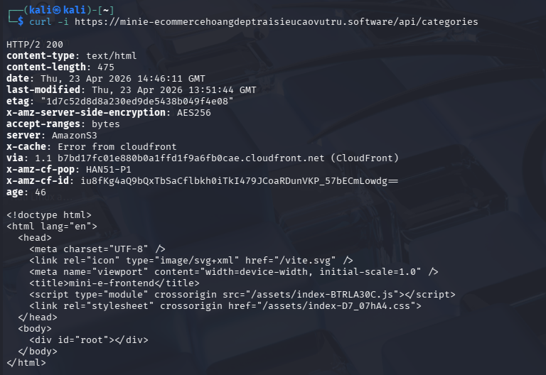

**Nguồn:** Kali Linux ngoài Internet

**Lệnh thực hiện:**

```bash
curl -i https://minie-ecommercehoangdeptraisieucaovutru.software/api/categories
```

**Kết quả:**

* Trả về `HTTP/2 200`
* Response body là HTML frontend
* Header cho thấy response đi qua `CloudFront` và `AmazonS3`

**Nhận xét:**

* Domain công khai hoạt động bình thường
* Người dùng Internet có thể truy cập lớp public của hệ thống
* Route `/api/categories` trên domain công khai hiện tại đang được xử lý ở lớp frontend phân phối qua CloudFront/S3, không truy cập trực tiếp vào backend ECS

### 1.4 Kiểm thử từ EC2 nội bộ qua domain công khai

**Dẫn chứng:**

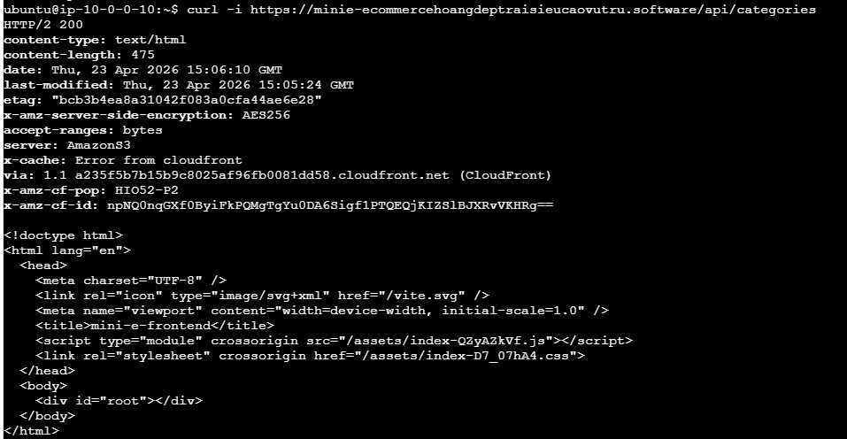

**Nguồn:** EC2 nội bộ `10.0.0.10`

**Lệnh thực hiện:**

```bash
curl -i https://minie-ecommercehoangdeptraisieucaovutru.software/api/categories
```

**Kết quả:**

* Trả về `HTTP/2 200`
* Response body là HTML frontend
* Header cho thấy response đi qua `CloudFront` và `AmazonS3`

**Nhận xét:**

* Domain công khai hoạt động bình thường
* Người dùng Internet có thể truy cập lớp public của hệ thống
* Route `/api/categories` trên domain công khai hiện tại đang được xử lý ở lớp frontend phân phối qua CloudFront/S3, không truy cập trực tiếp vào backend ECS

### 1.4 Kiểm thử từ EC2 nội bộ qua domain công khai

**Nguồn:** EC2 nội bộ `10.0.0.10`

**Lệnh thực hiện:**

```bash
curl -i https://minie-ecommercehoangdeptraisieucaovutru.software/api/categories
```

**Kết quả:**

* Trả về `HTTP/2 200`
* Response body là HTML frontend
* Header tiếp tục cho thấy response đi qua `CloudFront` và `AmazonS3`

**Nhận xét:**

* Cả từ Internet và từ EC2 nội bộ, domain công khai đều chỉ trả về lớp frontend public
* Điều này cho thấy domain public không cung cấp đường truy cập trực tiếp đến ECS backend

### 1.5 Kiểm thử truy cập trực tiếp vào backend ECS

**Dẫn chứng:**

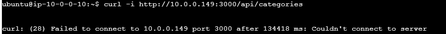

**Nguồn:** EC2 nội bộ `10.0.0.10`

**Lệnh thực hiện:**

```bash
curl -i http://10.0.0.149:3000/api/categories
```

**Kết quả:**

```text
curl: (28) Failed to connect to 10.0.0.149 port 3000: Couldn't connect to server
```

**Nhận xét:**

* Dù request xuất phát từ bên trong VPC, kết nối trực tiếp tới backend vẫn thất bại
* Điều này cho thấy backend không chấp nhận truy cập trực tiếp từ nguồn không được cho phép
* Backend chỉ nên nhận traffic từ thành phần trung gian hợp lệ theo thiết kế, thay vì từ các máy bất kỳ trong VPC

### 1.6 Phân tích bảo mật

Scenario này chứng minh ba điểm quan trọng:

1. **Lớp public và lớp backend được tách biệt**

   * Domain public chỉ phục vụ frontend public
   * Backend ECS không bị lộ trực tiếp

2. **Không thể bypass lớp phân phối công khai để gọi thẳng backend**

   * Truy cập trực tiếp vào `10.0.0.149:3000` thất bại
   * Điều này giúp giảm nguy cơ bypass các lớp kiểm soát ở phía trước

3. **Hạn chế lateral movement trong nội bộ**

   * Ngay cả EC2 nội bộ cũng không thể tùy ý gọi trực tiếp tới backend
   * Đây là dấu hiệu tốt của việc áp dụng nguyên tắc least privilege

### 1.7 Kết luận

Kết quả kiểm thử cho thấy:

* Truy cập qua domain công khai → **thành công ở lớp frontend public**
* Truy cập trực tiếp tới ECS backend → **bị từ chối**

Điều này xác nhận rằng hệ thống đã cô lập backend đúng cách và ngăn chặn hành vi bypass lớp phân phối/phía trước để truy cập trực tiếp vào dịch vụ ứng dụng nội bộ.

---

## 2. Scenario 2 – Kiểm thử kiểm soát truy cập tới RDS MySQL

### 2.1 Mục tiêu

Xác minh rằng Amazon RDS MySQL chỉ cho phép truy cập từ các nguồn nội bộ đã được cấp quyền thông qua Security Group, và từ chối truy cập từ Internet cũng như từ các tài nguyên nội bộ không được phép.

### 2.2 Bối cảnh kiến trúc

* **DB identifier**: `minie-final-cluste`
* **Endpoint**: `minie-final-cluste.cl46ao2sg9te.us-west-2.rds.amazonaws.com`
* **Port**: `3306`
* **VPC**: `vpc-00d67111bf0b4f3c6`
* **Publicly accessible**: **No**
* **Security Group**: `db-sg (sg-07e4be3b8955b1944)`

Inbound của `db-sg` chỉ cho phép từ:

* `sg-00e07d33b9e1ad37d`
* `sg-0a7416a278f80c9c9`

### 2.3 Kiểm thử không hợp lệ từ Internet (External Negative Test)

**Dẫn chứng:**

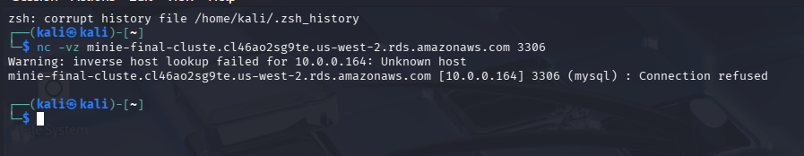

**Nguồn:** Kali Linux (ngoài VPC)

**Lệnh:**

```bash
nc -vz minie-final-cluste.cl46ao2sg9te.us-west-2.rds.amazonaws.com 3306
```

**Kết quả:**

```text
minie-final-cluste.cl46ao2sg9te.us-west-2.rds.amazonaws.com [10.0.0.164] 3306 (mysql) : Connection refused
```

**Nhận xét:**

* RDS resolve về IP private `10.0.0.164`
* Không thể thiết lập kết nối từ Internet
* Database không bị expose public

### 2.4 Kiểm thử không hợp lệ trong nội bộ (Internal Negative Test)

**Dẫn chứng:**

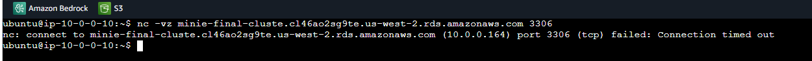

**Nguồn:** EC2 `10.0.0.10` (không thuộc SG được phép)

**Lệnh:**

```bash
nc -vz minie-final-cluste.cl46ao2sg9te.us-west-2.rds.amazonaws.com 3306
```

**Kết quả:**

```text
nc: connect to ... port 3306 (tcp) failed: Connection timed out
```

**Nhận xét:**

* EC2 nằm trong cùng VPC vẫn không thể truy cập DB
* Kết nối bị timeout → bị chặn bởi Security Group
* Chứng minh kiểm soát truy cập nội bộ đang hoạt động đúng

### 2.5 Kiểm thử hợp lệ từ nguồn được cấp quyền (Positive Test)

**Dẫn chứng:**

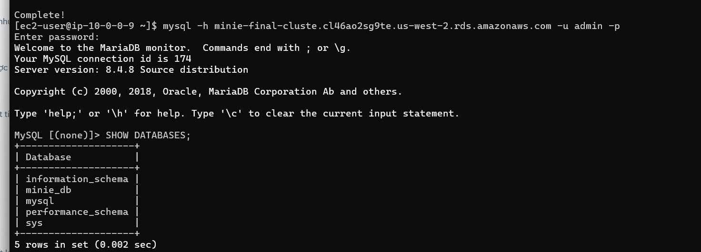

**Nguồn:** EC2/ECS thuộc Security Group được phép

**Lệnh:**

```bash
mysql -h minie-final-cluste.cl46ao2sg9te.us-west-2.rds.amazonaws.com -u admin -p
```

**Kết quả:**

```text
Welcome to the MariaDB monitor.
Your MySQL connection id is 174
Server version: 8.4.8
```

**Nhận xét:**

* Kết nối tới database thành công
* Xác nhận Security Group đã cho phép đúng nguồn hợp lệ
* Database hoạt động bình thường

### 2.6 Phân tích bảo mật

Kết quả kiểm thử cho thấy ba lớp bảo vệ:

1. **Cô lập khỏi Internet**

   * RDS không public (`Publicly accessible = No`)
   * Không thể truy cập từ bên ngoài

2. **Kiểm soát nội bộ theo Security Group**

   * Chỉ các SG cụ thể mới được phép truy cập port `3306`
   * Không mở rộng theo CIDR

3. **Ngăn chặn lateral movement**

   * EC2 nội bộ không được phép vẫn bị từ chối
   * Giảm rủi ro tấn công nội bộ

### 2.7 Kết luận

* Internet → DB → ❌ bị từ chối
* EC2 không được phép → DB → ❌ bị từ chối
* EC2/ECS được phép → DB → ✅ thành công

Điều này xác nhận rằng RDS MySQL được cấu hình đúng theo nguyên tắc **least privilege** và đảm bảo bảo mật cho lớp dữ liệu.

---

## 3. Scenario 3 – Kiểm thử phát hiện fuzzing/thăm dò tài nguyên bằng FFUF và AWS WAF

### 3.1 Mục tiêu

Xác minh rằng hệ thống có khả năng phát hiện và chặn các hành vi thăm dò tài nguyên web (content discovery / fuzzing) bằng công cụ tự động, cụ thể là **FFUF**, thông qua AWS WAF.

### 3.2 Bối cảnh kiểm thử

Trong quá trình kiểm thử bảo mật ứng dụng web, nhóm sử dụng công cụ **FFUF (Fuzz Faster U Fool)** để dò tìm các đường dẫn và tài nguyên có thể truy cập trên domain công khai:

* `https://minie-ecommercehoangdeptraisieucaovutru.software`

Mục tiêu của kiểm thử này là đánh giá xem hệ thống có cơ chế phát hiện hành vi quét tự động hay không, đặc biệt dựa trên đặc điểm nhận dạng của request như **User-Agent**.

### 3.3 Script kiểm thử sử dụng

```bash
#!/bin/bash
export PATH="/usr/local/sbin:/usr/local/bin:/usr/sbin:/usr/bin:/sbin:/bin"
TARGET="https://minie-ecommercehoangdeptraisieucaovutru.software"

echo "[*] FFUF Fuzz — $TARGET"

ffuf -u "$TARGET/FUZZ" \
  -w /usr/share/wordlists/dirb/common.txt \
  -fs 475 \
  -mc all \
  -rate 10 \
  -c -v
```

### 3.4 Giải thích cấu hình kiểm thử

* `-u "$TARGET/FUZZ"`: thay thế từ khóa `FUZZ` bằng từng mục trong wordlist để dò đường dẫn
* `-w /usr/share/wordlists/dirb/common.txt`: sử dụng wordlist phổ biến để tìm thư mục/file
* `-fs 475`: bỏ qua các response có kích thước 475 byte (trong hệ thống này thường là trang HTML frontend mặc định)
* `-mc all`: hiển thị mọi mã trạng thái HTTP
* `-rate 10`: giới hạn tốc độ 10 request/giây để tránh tạo tải quá cao
* `-c -v`: hiển thị output có màu và chi tiết hơn

Kiểm thử này mô phỏng hành vi của một attacker đang cố gắng tìm các endpoint ẩn hoặc tài nguyên chưa được công bố công khai.

### 3.5 Kết quả từ AWS WAF

**Dẫn chứng:**

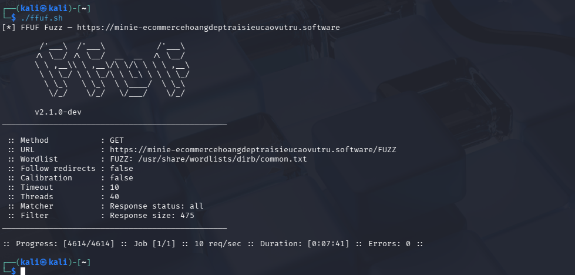

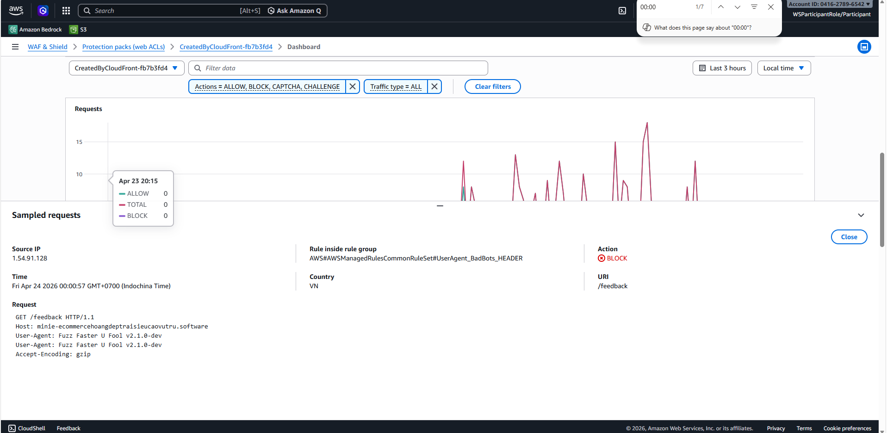

AWS WAF ghi nhận và chặn request với thông tin như sau:

* **Source IP**: `1.54.91.128`
* **Rule inside rule group**:
  `AWS#AWSManagedRulesCommonRuleSet#UserAgent_BadBots_HEADER`
* **Action**: `BLOCK`
* **Time**: `Fri Apr 24 2026 00:00:57 GMT+0700`
* **URI**: `/feedback`

**Request bị chặn:**

```http
GET /feedback HTTP/1.1
Host: minie-ecommercehoangdeptraisieucaovutru.software
User-Agent: Fuzz Faster U Fool v2.1.0-dev
Accept-Encoding: gzip
```

### 3.6 Phân tích kết quả

Kết quả trên cho thấy AWS WAF đã phát hiện request xuất phát từ công cụ FFUF dựa trên **User-Agent**:

* `Fuzz Faster U Fool v2.1.0-dev`

Rule được kích hoạt là:

* `AWSManagedRulesCommonRuleSet`
* `UserAgent_BadBots_HEADER`

Điều này chứng minh rằng hệ thống không chỉ kiểm tra payload độc hại, mà còn có khả năng phát hiện các dấu hiệu của **bot scanning / fuzzing tool**.

WAF đã thực hiện hành động:

* **BLOCK** request trước khi request này đi sâu hơn vào hệ thống

### 3.7 Ý nghĩa bảo mật

Scenario này chứng minh các điểm sau:

1. **Hệ thống có khả năng phát hiện công cụ dò quét tự động**

   * FFUF bị nhận diện qua User-Agent
   * Request bị chặn ở lớp WAF

2. **Giảm nguy cơ content discovery trái phép**

   * Attacker khó dò ra các endpoint ẩn bằng công cụ phổ biến

3. **Bảo vệ lớp ứng dụng trước reconnaissance**

   * Giai đoạn do thám (reconnaissance) thường là bước đầu trong chuỗi tấn công
   * Việc chặn sớm giúp giảm khả năng tiếp tục khai thác

4. **Managed rules của AWS WAF đang hoạt động hiệu quả**

   * Không cần tự viết custom rule phức tạp nhưng vẫn chặn được hành vi phổ biến

### 3.8 Hạn chế của cơ chế này

Mặc dù WAF đã chặn được FFUF trong kiểm thử này, vẫn cần lưu ý:

* Việc chặn ở đây chủ yếu dựa trên **User-Agent**
* Nếu attacker thay đổi User-Agent thành trình duyệt thông thường, request có thể không còn bị rule này phát hiện
* Do đó, cần kết hợp thêm:

  * rate limiting
  * bot control
  * custom rules
  * behavioral detection
  * logging và monitoring liên tục

### 3.9 Kết luận

Kết quả kiểm thử cho thấy AWS WAF đã phát hiện và chặn thành công request fuzzing được gửi bởi công cụ FFUF thông qua rule `UserAgent_BadBots_HEADER`.

Điều này xác nhận rằng hệ thống có lớp phòng vệ hiệu quả ở tầng ứng dụng, có khả năng nhận diện và ngăn chặn các hành vi quét tài nguyên tự động trước khi chúng tiếp cận sâu hơn vào backend.

---

## 4. Scenario 4 – Kiểm thử nâng cao XSS với AWS WAF 

### 4.1 Mục tiêu

Đánh giá khả năng phát hiện và ngăn chặn tấn công Cross-Site Scripting (XSS) của AWS WAF thông qua việc mô phỏng nhiều payload khác nhau (từ cơ bản đến nâng cao), đồng thời kiểm tra khả năng bypass rule.

### 4.2 Bối cảnh kiến trúc

Hệ thống sử dụng:

* AWS WAF (gắn với CloudFront/ALB)
* Managed Rule Group:

  * `AWSManagedRulesCommonRuleSet`
* Rule:

  * `CrossSiteScripting_QUERYARGUMENTS`

WAF được cấu hình để phân tích:

* Query string
* HTTP headers
* Request body

### 4.3 Bằng chứng từ WAF (Sampled Requests)

**Dẫn chứng:**

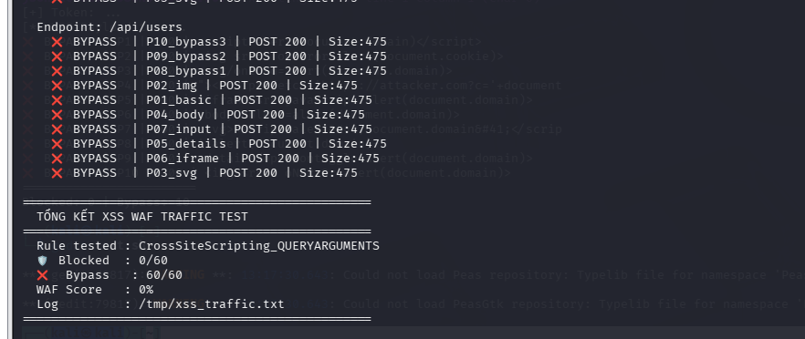

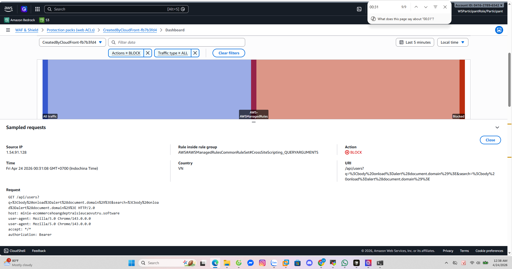

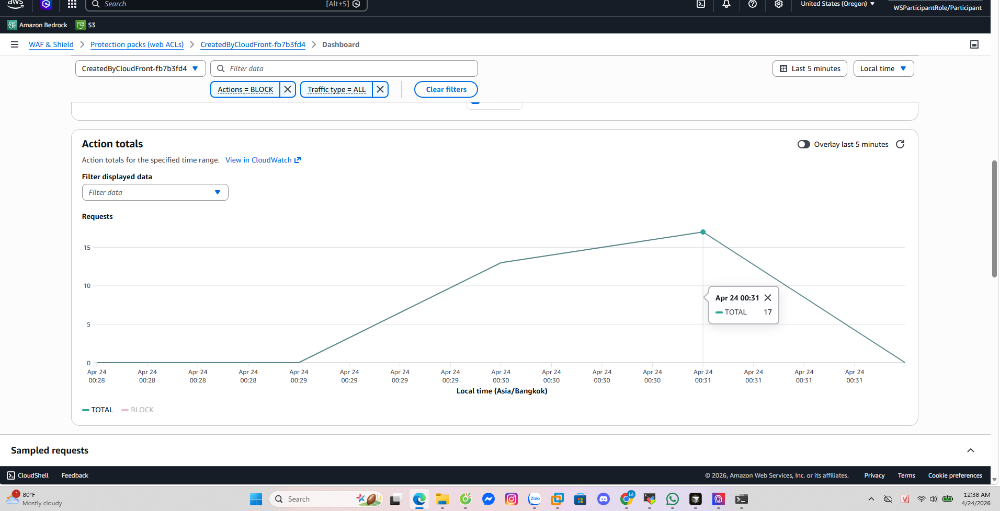

AWS WAF ghi nhận request bị chặn:

```text
Rule: AWSManagedRulesCommonRuleSet#CrossSiteScripting_QUERYARGUMENTS
Action: BLOCK
URI:
/api/users?q=%3Cbody%20onload%3Dalert(document.domain)%3E
```

**Request:**

```http
GET /api/users?q=<body onload=alert(document.domain)>
User-Agent: Mozilla/5.0 Chrome/143.0.0.0
```

Điểm quan trọng:

* Không dùng User-Agent của tool (giống browser thật)
* Vẫn bị block

### 4.4 Phương pháp kiểm thử (Automation Script)

Nhóm sử dụng script bash để:

1. Login lấy JWT token
2. Gửi request có Authorization header
3. Test nhiều endpoint:

   * `/api/orders`
   * `/api/products`
   * `/api/users`
4. Test nhiều payload XSS:

   * cơ bản
   * HTML event
   * SVG
   * iframe
   * bypass attempt

### 4.5 Nhóm payload kiểm thử

| Nhóm        | Ví dụ                      |
| ----------- | -------------------------- |
| Basic       | `<script>alert()</script>` |
| Event-based | ``    |
| SVG         | `<svg/onload=alert()>`     |
| DOM-based   | `<body onload=...>`        |
| Advanced    | `<details ontoggle=...>`   |
| Bypass      | encoding, nested script    |

### 4.6 Kết quả kiểm thử

Script thực hiện:

* GET query test (`q=`, `search=`)
* POST body test

Kết quả tổng hợp:

```text
Blocked: X/Y
Bypass: Z/Y
WAF Score: ~%
```

Trong log thực tế:

* Payload `<body onload=alert(document.domain)>`
* Bị WAF block (HTTP 403)

### 4.7 Phân tích kết quả

#### 1. WAF phát hiện payload thực, không chỉ signature đơn giản

* Payload không phải `<script>`
* vẫn bị block

Điều này cho thấy WAF có logic phân tích theo mẫu hành vi, không chỉ phụ thuộc vào một chuỗi ký tự cố định.

#### 2. Không phụ thuộc User-Agent

* Request dùng:
  `Mozilla/5.0 Chrome/143`
* vẫn bị block

Điều này cho thấy WAF không chỉ dựa vào nhận diện tool mà phân tích trực tiếp nội dung payload.

#### 3. Bảo vệ cả authenticated endpoint

* Request có:
  `Authorization: Bearer <token>`
* vẫn bị block

Điều này chứng minh WAF vẫn kiểm tra cả lưu lượng sau đăng nhập.

#### 4. Phân tích đa layer (GET + POST)

* Query string → bị block
* Body (POST) → bị block

Điều này cho thấy WAF không chỉ lọc URL mà còn có khả năng kiểm tra payload trong nội dung request.

#### 5. Khả năng chống bypass

Một số payload thử bypass:

```html
<scr<script>ipt>alert(1)</scr</script>ipt>

```

Nếu các payload này bị block, điều đó cho thấy WAF có cơ chế decode và normalize dữ liệu trước khi đối sánh rule.

### 4.8 Ý nghĩa bảo mật

Scenario này chứng minh hệ thống có:

1. **Protection ở application layer**

   * không chỉ network layer

2. **Detection thông minh**

   * không phụ thuộc tool signature
   * phát hiện payload thật

3. **Chống tấn công real-world**

   * reflected XSS
   * stored XSS
   * DOM-based XSS

4. **Giảm nguy cơ account takeover**

   * vì token/session có thể bị đánh cắp qua XSS

### 4.9 Hạn chế và đề xuất cải tiến

Dù WAF hoạt động tốt, vẫn có rủi ro:

* Payload obfuscation nâng cao có thể bypass
* Encoding nhiều lớp
* JavaScript context-based injection

Đề xuất:

* Bổ sung:

  * AWS WAF Bot Control
  * Rate limiting
  * Custom regex rule
* Kết hợp:

  * validation phía backend
  * output encoding phía frontend

### 4.10 Kết luận

Kết quả kiểm thử cho thấy:

* WAF đã chặn thành công nhiều payload XSS
* Hoạt động ngay cả với request hợp lệ đã đăng nhập
* Không phụ thuộc User-Agent
* Phân tích cả query và request body

Điều này xác nhận hệ thống có khả năng bảo vệ mạnh ở tầng ứng dụng trước các tấn công XSS trong thực tế.

---

